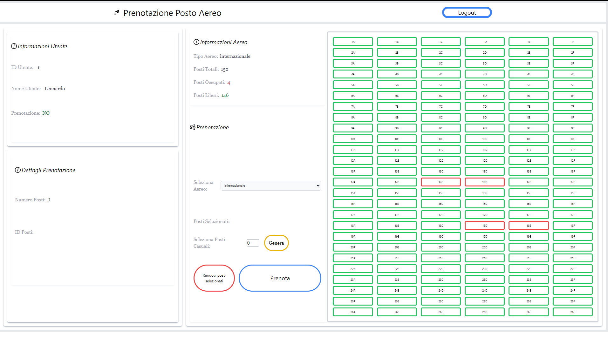

# Exam #12345: "Posti aereo"
## Student: s314587 Moracci Leonardo 

## React Client Application Routes

- Route `/`: homepage
- Route `/login`: login page
- Route `*`: not found page

## API Server

- POST `/api/session`

	-Description:
  	Crea una nuova sessione partendo dalle credenziali date

	-Request body:
  	{
  		"username": "leo@test.com",
  		"password": "pwd"
  	}

	-Response: `200 OK` (success) or `401 Unauthorized` (error).
	-Response body: _None_

- GET `/api/aerei`

	-Description:
  	Ottieni tutti gli aerei

	-Request body:
	_None_

	-Response: `200 OK` (success) or `500 Internal Server Error` (generic error).

	-Response body: Array di oggetti
	{ 
		id: e.id, name: e.name, 
		file: e.file, posti: e.posti 
	}

- GET `/api/aerei/:id`

	-Description:
  	Ottieni i posti occupati di un aereo dato l'id

	-Request body:
	_None_

	-Response: `200 OK` (success) or `404 Not Found` (error) or `500 Internal Server Error` (generic error).

	-Response body: Array di oggetti
	{ 
		id: e.id, idAereo: e.idAereo, 
		idUser: e.idUser, posto: e.posto
	}

- POST `/api/aerei/:idAereo`

	-Description:
  	Aggiungi tutti i posti della prenotazione per l' aereo dato nella tabella postiPrenotati. l'utente che aggiunge la prenotazione è dato dalla sessione corrente

	-Request body:
	prenotazione = 
	{
		idAereo: req.body.idAereo, 
		idUser: req.user.id
	};
    posti = req.body.posti

	-Response: `201 Created` (success) or `503 Service Unavailable` (generic error, e.g., provando a prenotare posti già occupati) or `404 Not Found` or `401 Unauthorized` or '422 Unprocessable entity' quando il dato non è valido

	-Response body: Array di oggetti
	id dei posti creati, as a JSON value (Content-Type: `application/json`)

- Delete `/api/aerei/:idAereo`

	-Description:
  	Elimina una prenotazione esistente nell'aereo indicato dall'id, effettuata dall'utene autenticato della sessione corrente

	-Request body: _None_

	-Response: `204 No Content` (success) or `503 Service Unavailable` (generic error). If the request does not come on an authenticated session, `401 Unauthorized`
	-Response body: _None_

## Database Tables

- Table `users` : (id, nome, email, salt, hash)
- Table `aerei` : (id, nome, file, posti)
- Table `postiPrenotati` : (id, idAereo, idUser, posto)

## Main React Components

- `HomePage` (in `App.jsx`): componente che renderizza tutti i componente presenti nell' Outlet della route /.
Il componente gestisce la maggior parte degli stati facendo le opportune API request.
Fa uso di una UseEffect per il caricamento dei dati iniziale e ad ogni logIn

- `AirPlane` (in `AirPlane.jsx`): componente che gestisce il render della griglia dell'aereo con la arrow-function 'buildgrid'; effettua il render dei componenti 'Row', i quali renderizzano al loro interno i componenti 'Seat'.
Le arrowfunction definite al suo interno gestiscono la prenotazione dei posti selezionati

- `Seat` (in `Airplane.jsx`): componente che si occupa della renderizzazione dei posti e dell'aggiornamento dei colori che figurano lo stato di prenotazione del posto

- `Prenotazione` (in `Varie.jsx`): componene centrale nella gestione della prenotazione dei posti da parte dell'utente; gestisce la logica della generazione dei posti random

- `LoginForm` (in `Varie.jsx`): componente responsabile del render dei componenti all'interno della route /login, che opera il logIn dell'utente

## Screenshot

## Users Credentials

-username, password
- leo@test.com, pwd
- mario@test.com, pwd
- carlo@test.com, pwd
- massimo@test.com, pwd
